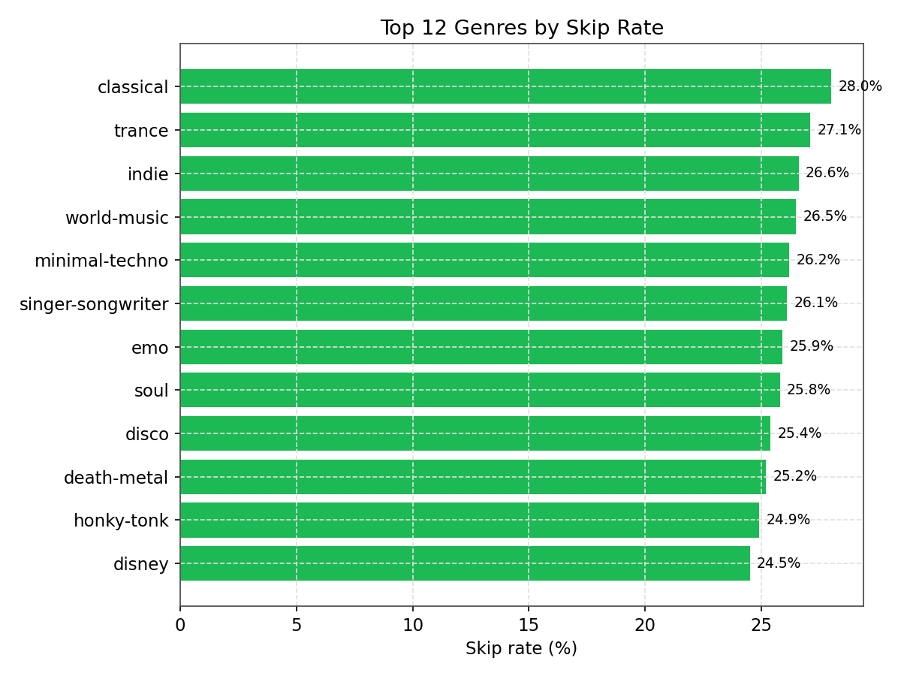
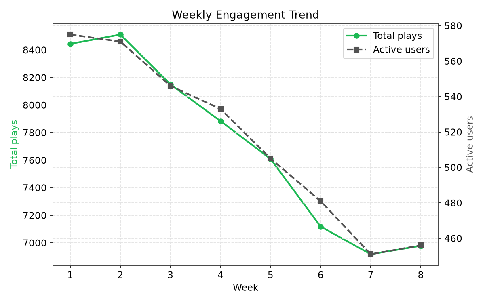
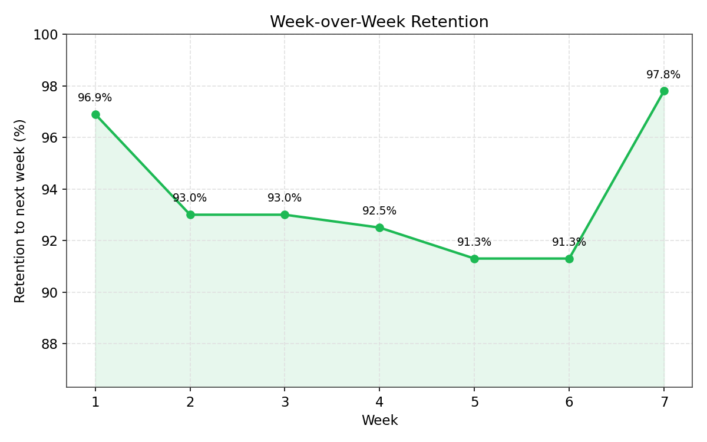
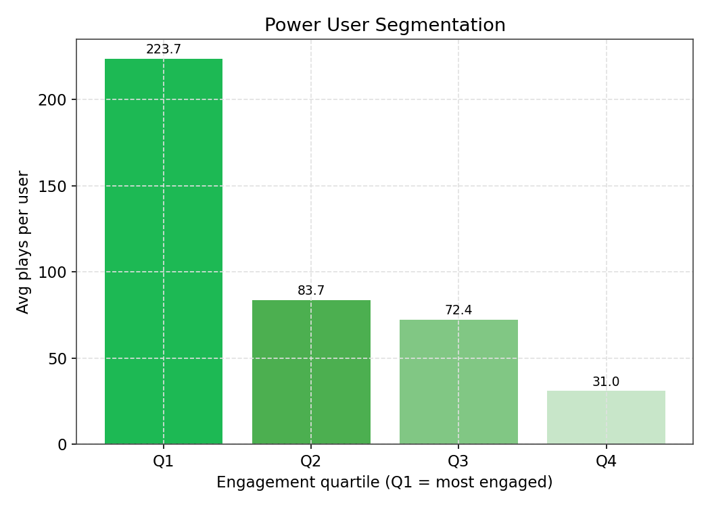
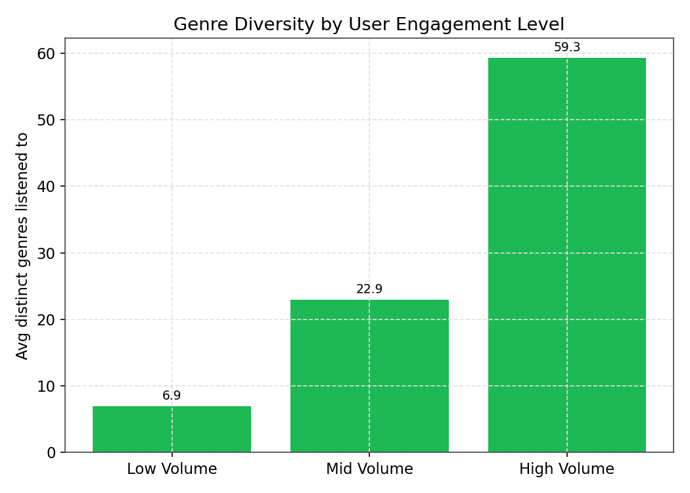
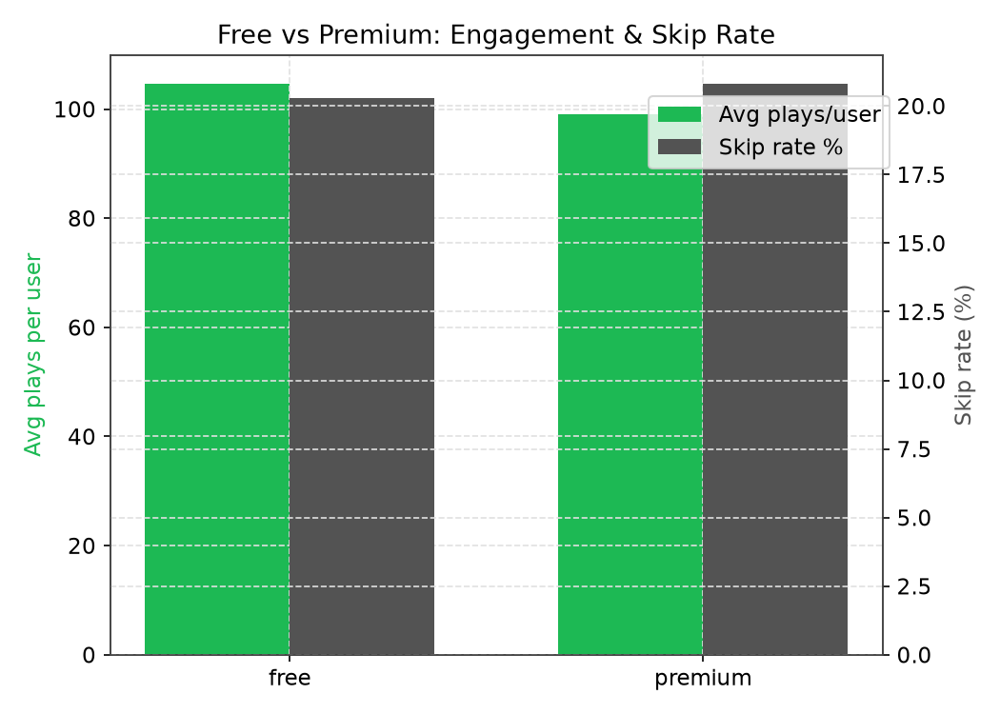

# Spotify Product Analytics + AI Insights

A SQL-driven product analytics project over Spotify listening data, with an
LLM layer on top that turns raw query results into a plain-English insights
summary — the kind of readout a product analyst would write after pulling
the numbers.

## What this project does

1. **Data**: Real track/audio-feature data (89.7k tracks, 113 genres) from
   the public [Spotify Tracks Dataset](https://huggingface.co/datasets/maharshipandya/spotify-tracks-dataset).
   Since per-user listening history isn't public, a realistic **synthetic**
   layer of 600 users and ~61.6k listening events is generated on top of the
   real tracks, with different user behavior segments (power users, casual
   listeners, users who churn partway through, dormant users) so the data
   has genuine patterns to find — not random noise.
2. **SQL**: All analysis is done in SQL against a SQLite database — skip
   rate by genre, week-over-week engagement trend, retention, power-user
   segmentation (via `NTILE` window functions), genre diversity, and a
   free-vs-premium comparison. See `sql/analysis_queries.sql`.
3. **AI layer**: The SQL results are formatted and sent to a free LLM
   (Groq, running Llama 3.3 70B) with a product-analyst prompt, which
   returns a short bullet-point summary + one recommendation. See
   `scripts/generate_insights.py`.

## Project structure

```
spotify-analytics-ai/
├── data/
│   ├── tracks.csv          # cleaned track/audio-feature data
│   ├── users.csv           # synthetic user profiles
│   └── listen_events.csv   # synthetic listening events
├── sql/
│   ├── schema.sql              # table definitions
│   └── analysis_queries.sql    # the 7 core analysis queries
├── scripts/
│   ├── generate_events.py      # regenerates the synthetic user/event data
│   ├── build_db.py             # loads CSVs into spotify_analytics.sqlite
│   ├── generate_insights.py    # runs queries + calls the AI summary
│   ├── generate_charts.py      # renders static PNG charts (for README/GitHub)
│   └── generate_dashboard.py   # builds a standalone interactive HTML dashboard
├── charts/                 # PNG charts (generated)
├── dashboard.html          # interactive Chart.js dashboard (generated, open in browser)
├── insights_report.md      # sample output (already generated once)
├── .env                    # your Groq API key (keep this out of git)
└── .gitignore
```

## Charts

### Skip rate by genre


### Weekly engagement trend


### Week-over-week retention


### Power user segmentation


### Genre diversity by engagement level


### Free vs premium


There's also `dashboard.html` — a single self-contained file with all of the
above as interactive Chart.js charts plus the latest AI-generated summary.
Just open it in a browser, no server, no live DB connection needed (the data
is baked in at generation time). Regenerate it any time with
`python3 scripts/generate_dashboard.py` after rebuilding the DB or rerunning
the insights script.

## How to run it yourself

1. **Install dependencies**:
   ```
   pip install pandas numpy groq
   ```
2. **(Optional) Regenerate the data** — only needed if you want to change
   the number of users, weeks, or behavior logic. This step also needs the
   raw dataset, which isn't checked in: download `dataset.csv` from the
   [Spotify Tracks Dataset](https://huggingface.co/datasets/maharshipandya/spotify-tracks-dataset)
   and save it as `data/tracks_raw.csv`. The cleaned `data/tracks.csv` is
   already in the repo, so skip this if you just want to build the DB.
   ```
   python3 scripts/generate_events.py
   ```
3. **Build the database**:
   ```
   python3 scripts/build_db.py
   ```
4. **Get a free Groq API key** (no credit card) at [console.groq.com](https://console.groq.com) →
   API Keys → Create Key. Put it in `.env` as `GROQ_API_KEY=your_key_here`
   (already done for you if you're reading this after the first run).
5. **Generate the AI insights report**:
   ```
   python3 scripts/generate_insights.py
   ```
   This prints the summary and writes the full report to
   `insights_report.md`.

## Design decisions worth knowing (in case you're asked)

- **Why SQLite, not Postgres/MySQL?** Zero setup — it's a single file, no
  server. All the SQL here (joins, CTEs, window functions) is standard and
  would run unchanged on Postgres/MySQL if you wanted to swap later.
- **Why synthetic listening events?** Real per-user Spotify listening logs
  aren't publicly available (privacy). Real track/audio-feature data is
  layered with a behavior simulation so the patterns (skip rates, churn,
  power users) are realistic and meaningful, rather than pulling in a toy
  dataset with no story to tell.
- **Why `NTILE(4)`?** It's the standard SQL way to split users into
  quartiles by engagement without hardcoding thresholds — the boundaries
  adjust automatically as the data changes.
- **Known artifact**: the last week in the retention query always shows
  0% retention, because there's no "week 9" to check whether those users
  came back. That's expected, not a bug — it's a boundary effect of a
  fixed 8-week window.
- **Why an LLM on top of SQL instead of just SQL?** The SQL answers "what
  happened." The LLM step answers "so what" — it turns 7 separate tables
  into a single readable summary a product manager could act on, without
  a human manually synthesizing across all of them each time.

## Sample output

See `insights_report.md` for a full example, generated from an actual run
against this data.
